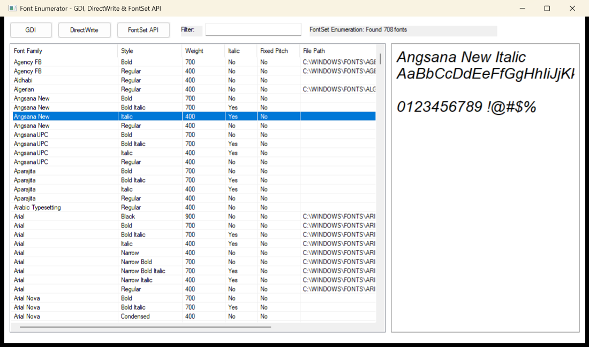

# Font Enumerator (C++)

A Windows desktop application for exploring system fonts, written in C++ using Win32 and DirectWrite APIs.



## Features

- **Three enumeration methods:**
  - **GDI** - Legacy API, available on all Windows versions
  - **DirectWrite** - Modern API with better Unicode support
  - **FontSet API** - Windows 10+ with variable font axis information

- **Font information displayed:**
  - Font family and style names
  - Weight (100-900)
  - Italic/Oblique flag
  - Fixed-pitch (monospace) indicator
  - File path (FontSet API only)
  - Variable font axes (FontSet API only)

- **Interactive features:**
  - Real-time filter/search
  - Font preview panel showing selected font with actual weight and style
  - Resizable window with responsive layout

## Building

### Prerequisites

- Visual Studio 2022 (or later) with C++ Desktop Development workload
- Windows 10 SDK

### Build with Visual Studio

1. Open `FontEnum.sln` in Visual Studio
2. Select `Release | x64` configuration
3. Build → Build Solution (Ctrl+Shift+B)

The executable will be at `bin\x64\Release\FontEnum.exe`.

### Build from Command Line

```batch
:: Open Developer Command Prompt for VS 2022
msbuild FontEnum.vcxproj /p:Configuration=Release /p:Platform=x64
```

## Project Configuration

- **Runtime Library:** Static CRT (`/MT` for Release, `/MTd` for Debug)
  - No Visual C++ Redistributable required
- **Character Set:** Unicode
- **C++ Standard:** C++17
- **Target Platform:** Windows 10+

## Architecture

The application follows a typical Win32 GUI structure:

```
main.cpp
├── Constants & Data Structures
│   ├── Control IDs (IDC_*)
│   ├── FontInfo struct
│   └── EnumMode enum
├── Entry Point (wWinMain)
├── Window Procedure (WndProc)
│   ├── WM_CREATE → CreateControls
│   ├── WM_SIZE → ResizeControls
│   ├── WM_COMMAND → button/edit handlers
│   └── WM_NOTIFY → ListView selection
├── Font Enumeration
│   ├── EnumerateGDIFonts
│   ├── EnumerateDirectWriteFonts
│   └── EnumerateFontSetFonts
├── Preview Panel (PreviewWndProc)
└── UI Helpers
    ├── ApplyFilter
    ├── PopulateListView
    └── UpdateStatusText
```

## Dependencies

Only Windows system DLLs are required:
- `KERNEL32.dll`
- `USER32.dll`
- `GDI32.dll`
- `COMCTL32.dll`
- `DWrite.dll`

## License

MIT License - see [LICENSE](LICENSE) for details.
